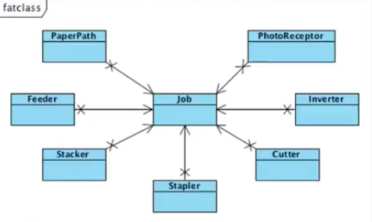
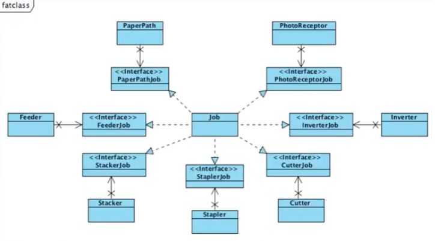

# ISP(Interface Segregation Principle)

### 개요

이번 장에서는 SOLID 중 네 번째 원칙인 Interface Segregation Principle에 대해서 알아보겠습니다. 

---

### ISP

어떤 인터페이스에 메서드 시그니처가 100개가 있고 클라이언트 A와 B는 이 중 30개만 사용한다고 가정하겠습니다. 이 때 A,B는 **자신이 사용하는 30개 외에 70개가 변경되었을 때에도 영향을 받습니다. 이것이 바로 ISP를 위반**하는 것입니다.

- 사용하는 것에만 의존해야 한다는 것이다
- SRP와도 연관되어있다.
    - 요구사항의 원인은 클라이언트다. 클라이언트가 사용하는 기능이 하나의 기능이다. 30개씩 2개의 클라이언트가 사용한다면 책임이 두개다.
    - 클라이언트 입장에서 인터페이스를 분리하고 바라보아라
- 사용하는 기능만 제공하도록 인터페이스를 분리하라. 이를 통해 하나의 기능에 대한 변경의 여파를 최소화할 수 있다.
- 이를 어떻게 해결할까?
    

    
    - Fat Class를 만나면 One Interface for a sub system
        - 인터페이스를 생성해서 위처럼 클라이언트로부터 분리시켜야 한다
        - Fat class에서 인터페이스를 쪼개서 다수의 인터페이스를 구현해라
        - 각각의 클래스를 대변할 수 있는 인터페이스를 만들자