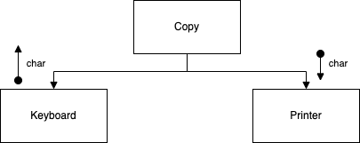
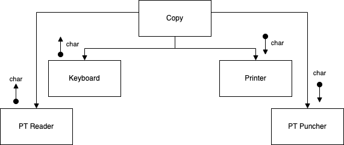
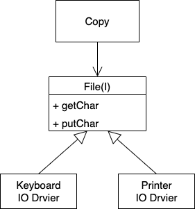

# SOLID Foundation

링크: https://www.youtube.com/watch?v=HIWJ8sF8lO8&list=PLeQ0NTYUDTmMM71Jn1scbEYdLFHz5ZqFA&index=14
유형: 작업 🔨
카테고리: OOP

### 개요

SOLID란 무엇이고 왜 필요한 것일까?

---

### The Source Code is the Design

엔지니어란 무엇일까? 어떤 역할을 하는 사람을 엔지니어라고 할까? 건축 엔지니어는 건물의 설계도를 그린다. 자동차 엔지니어는 자동차의 설계도를 그린다. 이렇듯 엔지니어는 청사진을 그리는 사람이다. 

그렇다면 소프트웨어 엔지니어는 무엇을 만들까? 물론 설계도다. 하지만 소프트웨어 엔지니어의 결과물은 조금 다르다. UML같은 설계도가 아니다. 소스코드가 도큐먼트다. 그런데 대뜸 이 애기를 왜 하는 것일까?

건물, 회로, 기계에 대한 전략과 소프트웨어의 전략은 다르다. 전자는 설계 단계에서는 비용이 매우 적다. 하지만 실제 구현(생산) 단계에 들어가게 되면 수정이 매우 어렵다.

반면 소프트웨어는 초기 설계 단계에 비용이 매우 크다. 여기서 말하는 설계는 소스 코드를 작성하는 것을 말한다. 하지만 구현 단계인 컴파일과 빌드는 비용이 아주 작다. IDE를 사용하면 버튼 한번 클릭하면 끝난다.

이제 왜 이 얘기를 했는지 느낌이 오는가? 소프트웨어에서 의존성 관리를 잘하고 설계를 잘 해놓는 것이 매우 비용이 높고 힘든 작업이다. 따라서 우린 **비용이 큰 설계라는 단계를 잘하기 위해 많은 노력**이 필요하다.

---

### Design Smells

앞서 말했듯 소프트웨어 엔지니어링에서 설계는 매우 비싼 비용이 필요하다. 따라서 좋은 설계(소스 코드 작성)를 하는 것은 선택이 아닌 필수다. 그렇다면 좋은 설계인지를 확인하기 위한 기준은 무엇이 있을까?

1. **Rigidity(강직성)**
    - 시스템의 강한 의존성때문에 변경하기가 어려워지는 것을 뜻한다.
    - 원인은 무엇일까?
        - 많은 시간이 소요되는 테스트와 빌드
            - 잦은 수정을 진행하고 이를 확인해보기 위해선 테스트와 빌드가 짧은 시간 안에 이뤄져야 한다.
            - 사람이 테스트한다거나 빌드가 자동화되어 있지 않다거나 하는 상황이라면 무척 난처하다.
            - ex) 머리가 번뜩여 10초만에 후다닥 고치고 10초만에 테스트해야 하는데 결과를 보는 데까지 2분을 기다리는 상황
        - 의존성 관리를 잘못해서 전체를 리빌드하는 케이스
    - 어떻게 Rigidity를 감소시킬 수 있을까?
        - 이제 살펴볼 SOLID를 지키면 된다
2. **Fragility(취약성)**
    - 한 모듈의 수정이 다른 여러 모듈에 영향을 끼치는 경우를 뜻한다.
        - 자동차 라디오 모듈의 수정이 창문 모듈에 영향을 끼치는 경우가 있다면? 이처럼 의존성이 말도 안되게 걸려있는 경우를 말한다.
        - 변경의 여파가 크다는 것은 버그가 발생할 가능성이 높다는 것이다.
            - 대게 1줄의 코드 수정은 3개의 버그를 유발한다고 말한다.
    - 문제는 의존성의 흐름이다. 의존성을 어떻게 제어할 수 있을까?
        - 컴파일 타임 의존성은 인터페이스를 통해 항상 해결할 수 있다.
3. **Immobility(부동성)**
    - 모듈을 재사용하고 싶지만 쉽게 추출되지 않아 재사용하는 작업이 쉽지 않는 경우를 말한다.
        - 예를 들어 로그인 모듈이 특정 DB의 스키마와 특정 UI에 강결합되어 있다면 이는 다른 모듈에서의 재사용이 어렵다
    - 이에 대한 해결책은 세부사항과의 결합도를 제거하는 것이다.
4. **Viscosity(점성)**
    - 빌드와 테스트같은 필수적인 작업들이 오래 걸려 실행이 꺼려진다면 시스템이 잘못 되었다는 것을 의미한다.
        - 예를 들면 Git 체크인, 체크아웃, 머지 등이 비용이 크다면? viscosity가 높다.
        - 변경이 매우 잦은 브랜치를 따서 많은 변경을 가한다면? 머지할 때 엄청난 충돌이 날 것이다.
            - 본문에선 역겹다고 표현한다.
    - 소스코드에 이런 문제가 생기는 대부분의 원인은 Irresponsible tolerance(무책임한 용인)이다.
        - 코드를 작성하는 개발자도 이것이 잘못된 것인지 안다. 하지만 여러 요인에 의해 넘어간다.
        - 결국은 누군가 그 똥을 밟게 되어있다.
    - 이를 해결하기 위해선 런타임 의존성은 유지한채로 컴파일 타임의 의존성를 벗겨내야 한다.
        - 런타임 의존성은 자연스레 흐르는 대로 두고, 컴파일 타임 의존성은 인터페이스를 통해 해결하면 된다.

---

### Procedural, OOP

위 예시는 OOP를 적용하지 않은 경우 어떤 문제점이 예상되는지를 확인하기 위해 만들어진 예시입니다. 

1. A 개발자에게 새로운 요구사항이 들어왔다. 만약 키보드 입력을 받아 프린터를 출력하는 요구사항이다. 이 때 아주 쉽게 구현하려면 아래처럼 구현하면 된다. 
    
    ```java
    public void copy(){
    		int c;
    		while ((c = readKeyboard()) != EOF) {
    				writePrinter(c);
    		}
    }
    ```
    
    구현은 끝냈지만 A 개발자는 이것만 할 순 없는 노릇이다. 현업팀의 문의사항도 처리해줘야하고 다른 프로젝트의 버그도 신경써야 하고 회의도 해야한다. 심지어 소스코드를 다운로드하는 것도 시간이 오래 걸린다. 첩첩산중이다. 그런데 여기에 요구사항이 또 추가됐다. 
    
2. 기존에는 키보드에 대한 입력만 받으면 됐지만, 새로 추가된 요구사항에는 종이 테입 리더기의 입력도 받아야 한다. 또 다시 빠르게 구현한다.
    
    ```java
    private boolean GptFlag = false;
    
    public void copy(){
    		int c;
    		while ((c = (GptFlag ? readPt() : readKeyboard())) != EOF) {
    				writePrinter(c);
    		}
    }
    ```
    
    입력이 종이 테입 리더기인지 키보드인지를 확인하는 플래그 변수를 생성해 빠르게 구현했다. 이를 통해 플래그값에 맞춰 입력 메서드를 호출하면 된다. 이 역시 빠르게 구현했다.
    
3. 맙소사. 요구사항이 또 들어왔다. 이번엔 출력 케이스에 종이 테입 펀처가 추가됐다. 이젠 입력과 출력이 각각 2개씩이다.
    
    ```java
    private boolean GptFlag = false;
    private boolean GpunchFlag = false;
    
    public void copy(){
    		int c;
    		while ((c = (GptFlag ? readPt() : readKeyboard())) != EOF) {
    				if(GpunchFlag) {
    						writePunch(c);
    				} else {
    						writePrinter(c);
    				}
    		}
    }
    ```
    
    2번과 동일하게 출력에 대한 플래그도 추가해 요구사항을 구현했다. 역시 빠르게 구현해서 끝낼 수 있었다. 
    

그런데 2,3번이 여러번 반복되면 어떻게 될까? 시간이 흐르고 점점 입출력 장치가 늘어나면 어떻게 될까? 계속 플래그 변수와 while 조건문의 삼항 연산자, if-else절을 추가하면 될까? 이는 누가 봐도 코드가 점점 지저분해지고 이해하기 힘들어지는 코드의 떡잎이다. 심지어 유연하지도 않다. 만약 이것이 OOP로 개발되었다면 아래와 같은 코드였을 것이다.

```java
public void copy(){
		int c;
		while ((c = getChar()) != EOF) {
				putChar(c);
		}
}
```

기존 readKeyboard가 있던 자리는 getChar()로, writePrinter()가 있던 자리는 putChar()로 변경됐다. 여기서 copy 메서드는 비즈니스 로직, High Level Policy다. 따라서 추가되는 입력장치나 출력장치와 같은 Low Level Detail에 대해서 영향을 받지 않도록 외부에서 인터페이스를 통해 입출력 장치 클래스를 주입하는 방식을 통해 객체의 의존성을 끊어냈을 것이다. 아래는 절차적 패러다임과 객체지향적 패러다임의 차이점이다.

1. **Procedural**
    - 절차적 패러다임은 하이 레벨이 로우 레벨에게 의존한다.
        - 위의 1번 예시를 보면 하이 레벨인 copy() 메서드가 로우 레벨인 Printer, KeyBoard에 직접 의존하고 있는 것을 볼 수 있다.
        - 아래는 1번에서의 객체 의존성 관계다.
            
            <p align="center"></p>
            
    - 여기서 장치의 갯수가 증가하면 Fan-out 문제가 발생한다.
        - copy는 장치가 추가될 때마다 의존하는 로우 레벨의 개수가 늘어나게 되고, 이 중 하나만 변경되더라도 영향을 받게 된다.
        - 이렇게 계속 의존성이 늘어나는 것을 fan-out 문제라고 한다.
        
        <p align="center"></p>
        
2. **OOP**
    - 반면 OOP는 하이 레벨이 로우 레벨 디테일에 의존하지 않는다.
        
        <p align="center"></p>
        
    - copy는 getChar, putChar 메서드를 갖는 File 인터페이스에 의존하지만, 이를 구현한 드라이버 클래스가 프린터가 될지 키보드가 될지 copy에서는 알 수가 없다.
    - 인터페이스를 통해 의존성을 끊어낼 수 있으며, 의존성의 방향이 **로우 레벨에서 하이 레벨로 향하는 의존성의 역전**이 일어난다.
        - 런타임 의존성은 상위 모듈에서 하위 모듈로 가는게 맞다.
        - 하지만 컴파일 타임에서는 위처럼 인터페이스를 통해 하위 레벨에서 상위 레벨로 갈 수 있도록 의존성이 역전되어야 한다.
    - 이것이 OOP의 **Dependency Inverted** 다. 이래야만 상위 모듈이 변경으로부터 안전하게 유지될 수 있다.

---

### OOP의 핵심

위에선 Procedural과 OOP의 구현 단계에서 어떤 차이점이 있는지를 살펴봤다. 절차지향과 달리 객제치향적 패러다임으로 구현했을 때 어떤 이점이 발생하는 지도 확인했다. 여기서 나온 내용을 종합해 객체지향의 핵심이 무엇일지 생각해보자. 

객체는 메시지가 누구한테 전달될 것인지 어떻게 세부적으로 동작하는지는 전혀 모른채 ‘그저’ 메시지를 전달한다. 인터페이스를 통해 내가 원하는 바대로 동작할 것이라고 믿고 무엇을 원하는지만 보내는 것이다. 이를 우린 **Dynamic polymorphism** 라고 부른다. 이것이 가능한 이유는 인터페이스를 통해 로우 레벨과 하이 레벨간의 의존성을 역전시키는 **Dependeny Inversion**를 구현했기 때문이다.

객체지향의 특성에서 언급되는 캡슐화, 추상화, 상속은 객체지향의 ‘메커니즘’일 뿐이다. 객체지향의 핵심은 Dependeny Inversion를 통해 IoC 구조를 만들고, High Level Policy와 Row Level Detail을 절연시켜 상위 레벨의 모듈을 하위 레벨의 모듈로부터 보호하는 것이다. 종합해보자면 객체지향 디자인은 ‘**의존성을 잘 관리하는 것**’이며, 이를 위해 지켜져야 하는 원칙이 바로 SOLID다.

### *Ref*

- [https://youtu.be/HIWJ8sF8lO8](https://youtu.be/HIWJ8sF8lO8)
- [https://github.com/msbaek/clean-coders-2013/blob/master/9.SRP.pdf](https://github.com/msbaek/clean-coders-2013/blob/master/9.SRP.pdf)