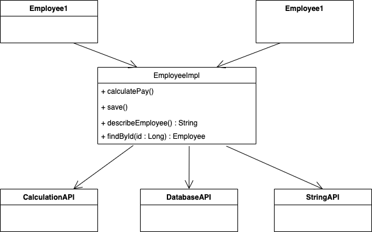

# SRP(Single Responsibility Principle)

### 개요

이번 장에서는 SOLID 중 첫 번째 원칙인 Single Responsibility Principle에 대해서 알아보겠습니다. 

---

### SRP란 무엇인가?

Single Responsibility Principle, 번역하면 단일 책임 원칙입니다. 단일 책임 원칙은 ‘하나의 클래스는 하나의 책임을 가져야 한다'는 원칙입니다. 하나의 클래스가 여러 개의 책임을 갖는 경우 메서드의 성질이 각 책임마다 상이하기 때문에 응집도가 낮아집니다. 또한 여러 클라이언트 객체와 의존 관계를 맺게 되기 때문에 높은 결합도를 가지게 되죠. 따라서 단일 책임 원칙은 **낮은 결합도와 높은 응집도**를 얻기 위해 꼭 필요합니다.

---

### Responsibility란 무엇인가?

그런데 사실 책임이라는 말이 이해하기에 직관적이진 않습니다. 아래 EmployeeImpl 클래스를 같이 살펴보며 ‘책임'이란 무엇일지 알아보겠습니다. 들어가기 전에 이 클래스 책임은 3개라는 사실을 미리 말씀드리겠습니다.

책임은 아마 비슷한 성질을 갖는 메서드들의 집합이지 않을까 생각해볼 수 있습니다. 뭔가 각각 메서드가 서로 비슷해보이지는 않으니까요. 그럼 만약 findById가 추가된다면 어떻게 될까요? 비슷해보이는 메서드가 없으니 책임이 4개가 된 것일까요? 단순히 ‘비슷한'이라는 감각적인 판단 기준으로는 명확한 책임을 분류하기 어렵습니다. 따라서 비슷한 성질을 갖는지에 대한 판단은 메서드를 사용하는 클라이언트를 통해 확인할 수 있습니다. 클라이언트의 요구사항이 변경된다면 요구사항과 관련된 메서드들도 전부 변경이 필요할테니까요. 다같이 변경된다는 것은 비슷한 성질을 갖는다는 반증이니까요. 

그렇다면 calculateDeduction, calculateSalary가 추가된다면 어떻게 될까요? 앞서 추가된 findById는 save와 함께 **데이터베이스를 다루는 클라이언트**로부터 요청을 받습니다. 그렇다면 이 둘을 하나의 책임이라고 볼 수 있지 않을까요? 뒤이어 추가된 calculateDeduction, calculateSalary는 calculatePay처럼 **정산을 다루는 클라이언트**로부터 요청을 받습니다. 이 역시 하나의 책임으로 묶을 수 있을 겁니다.

이렇듯 책임은 **메서드의 변경을 유발하는 클라이언트**를 기준으로 분류하는 행위를 통해 찾을 수 있습니다. 즉 SRP에서 말하는 Responsibility는 **변경의 근원(원인)**입니다. 변경의 근원이 되는 클라이언트 그룹의 수가 책임의 수와 같다고 봐야 한다는 것이죠. 이 기준을 통해 바라보면 EmployeeImpl 클래스는 변경을 유발하는 클라이언트의 그룹이 총 3개입니다. 데이터베이스 관련 사용자들, 정산 관련 사용자들 그리고 리포팅 관련 사용자들, 총 세 부류의 사용자들이 클래스를 사용하며 변경의 원인이 되고 있습니다. 따라서 세 가지의 책임을 가지고 있다고 말할 수 있죠. 

여기서 세 부류로 나눠진 클라이언트들을 우린 **Actor(액터)**라고 부릅니다. 액터들은 보다시피 서로 다른 니즈를 가지며 클래스에게 예상하는 바도 각각 다릅니다. 그리고 액터들 전부 한 가지 역할을 수행하는 사람들이 뭉쳐진 그룹입니다. 

이를 위의 내용과 연관지어 말해보자면 책임이란 ‘**특정 액터의 요구사항을 만족시키는 일련의 함수의 집합**'이라고 바꿔부를 수 있을 겁니다.

---

### 한 클래스에 많은 책임이 있다면 어떤 문제가 생길까?

여기서 각 액터들은 Architecture Actor(DB), Policy Actors(calculate), Operations Actors(describe)로 표현하겠습니다. 위에서 EmployeeImpl 클래스는 세가지의 책임을 갖고 있다고 말했습니다. 하지만 객체지향적인 좋은 설계를 위해선 하나의 클래스에는 하나의 책임만이 존재해야 한다고 합니다. 글의 제목인 SRP가 바로 그 의미죠. 왜 세 개는 안되는 것일까요? 어떤 문제가 생기길래 하나의 책임만 가지라고 하는 것일까요? 이제 하나의 클래스가 여러 개의 책임을 가지고 있을 때 어떤 문제가 발생하는지 살펴보겠습니다.

1. **Fan out**
    
    Employee 클래스가 너무 많은 API를 사용하면 이 API 중 하나만 변경되도 클래스가 변경됩니다. 즉 클래스가 변경에 **너무 예민해진다는 것을 의미**하며, 이 클래스를 사용하는 클라이언트 역시 더 민감해진다. 이는 변경에 대한 영향을 제어할 수 없을 정도로 멀리 퍼져버린다고 볼 수 있다.
    
    

    

1. **Collocation is Coupling**
    
    만약 Operations Actors의 요구사항이 추가되었다고 가정하면 우리는 기존 요구사항들은 변함이 없음에도 불구하고 EmployeeImpl 클래스에 수정이 발생하게 됩니다. 이 문제도 역시 한 가지의 수정이 동일 모듈 전체에 영향을 끼침으로써 발생되는 문제이다.
    

---

### 해결방법

그렇다면 이렇게 만들려면 어떤 방법이 있을까?

1. **Inverted Dependencies**
    - 클래스를 인터페이스와 클래스로 분리시키자
    - 메서드들을 하나의 인터페이스로 다 모으자
2. **Extract Classes**
    - Emplyee를 예시로 들면 3개의 책임을 3개의 클래스로 분리하자
    - Employee 개념이 각각 3개의 조각으로 분리되어 있다
3. **Inverted Dependencies & Extract Classes**
    - Inverted Dependencies에서 하나로 모은 인터페이스를 세개로 나누자
    - 그리고 이를 각각 구현하면 위 두개에서 갖던 문제를 해결할 수 있다.
4. **Facade(파사드)**
    - 어디에 구현이 되어있는지 찾기 쉽게
    - 파사드가 모든 책임을 하나에 모으고 각 책임을 갖는 클래스에 위임해주는 방식
5. **Interface Segregation**
    - 위애서처럼 3개의 인터페이스로 나누고 하나의 클래스로 구현하는 방식
    - 액터들은 실제 구현 클래스와 의존성이 없지만 어디에 구현됐는지 찾기 어렵다

---

### 마치며

- 리팩토링 역량을 기르기 위해선?
    - 단위 테스트
    - 좋은 아키텍쳐를 만들기 위해서 리팩토링을 많이 시도해보자
- 한 줄로 정리
    - 한 모듈이 하나의 액터를 위한 책임을 갖도록 분리하는 설계를 하는 것
    - 늘 객체에 대해 액터를 찾고 이에 기반하여 모듈을 분리하라

---

### *Ref*

- [https://steady-coding.tistory.com/370](https://steady-coding.tistory.com/370)
- [https://www.youtube.com/watch?v=AdANHDp5dTM&list=PLeQ0NTYUDTmMM71Jn1scbEYdLFHz5ZqFA&index=15](https://www.youtube.com/watch?v=AdANHDp5dTM&list=PLeQ0NTYUDTmMM71Jn1scbEYdLFHz5ZqFA&index=15)